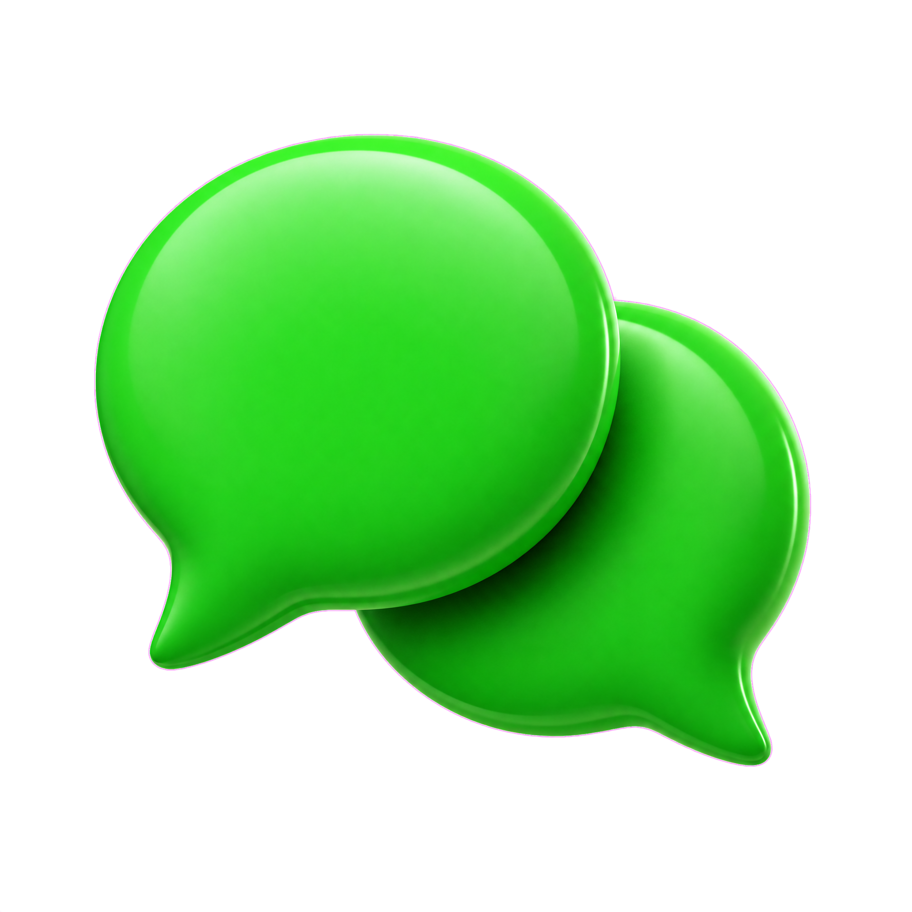

<!DOCTYPE html>
<html lang="ar" dir="rtl">
<head>
    <meta charset="UTF-8" />
    <meta name="viewport" content="width=device-width, initial-scale=1.0, maximum-scale=1.0, user-scalable=yes" />
    <title>سياسة الخصوصية - شات بوت</title>
    <!-- Google Fonts -->
    <link rel="preconnect" href="https://fonts.googleapis.com" />
    <link rel="preconnect" href="https://fonts.gstatic.com" crossorigin />
    <link href="https://fonts.googleapis.com/css2?family=Tajawal:wght@400;500;700&display=swap" rel="stylesheet" />
    <!-- Font Awesome 6 -->
    <link rel="stylesheet" href="https://cdnjs.cloudflare.com/ajax/libs/font-awesome/6.0.0-beta3/css/all.min.css" />
    
</head>
<body>
    

        <!-- الملف الشخصي مع شارة ✦ AI وزر الترجمة -->
        

            <!-- حاوية الصورة الرمزية مع شبكة عصبية -->
            

                
            

            

                <h1>سياسات والخصوصية شات بوت</h1>
                
الإثنين 10 اغسطس 2026

            

            <!-- شارة ✦ AI بالزجاج -->
            

                <i class="fas fa-star"></i> ✦ AI
            

            <!-- أزرار الصوت والترجمة -->
            

                <button class="read-btn" id="readAloudBtn" type="button" aria-label="قراءة النص بصوت">
                    <svg viewBox="0 0 24 24" width="26" height="26"><path d="M3 9v6h4l5 5V4L7 9H3zm13.5 3c0-1.77-1.02-3.29-2.5-4.03v8.05c1.48-.73 2.5-2.25 2.5-4.02zM14 3.23v2.06c2.89.86 5 3.54 5 6.71s-2.11 5.85-5 6.71v2.06c4.01-.91 7-4.49 7-8.77s-2.99-7.86-7-8.77z"/></svg>
                </button>
                <button class="translate-btn" id="translateBtn" type="button" aria-label="ترجمة إلى الإنجليزية">
                    <i class="fas fa-language"></i>
                </button>
            

        

        <!-- محتوى السياسة (عربي + إنجليزي) -->
        

            

                <h6>سياسة الخصوصية لبوت [Chatbot]

آخر تحديث: [الثلاثاء 28 يوليوز 2026]

مرحباً بك في بوت [Chatbot]. نحن نلتزم بحماية خصوصيتك وشفافية التعامل مع بياناتك. توضح هذه السياسة كيفية جمع معلوماتك واستخدامها وحمايتها عند تفاعلك مع بوتنا عبر فيسبوك ماسنجر.

1. المعلومات التي نجمعها

عند استخدامك للبوت، قد نقوم بجمع:

· المعلومات الأساسية: معرف المستخدم الخاص بالصفحة (PSID)،والاسم العام لملفك الشخصي على فيسبوك.
· محتويات المحادثة: الرسائل التي ترسلها للبوت، والأسئلة التي تطرحها، والتعليمات التي تقدمها.
· بيانات التفاعل: سجل نقاطك، وتاريخ ووقت المحادثات، وعدد المرات التي تستخدم فيها البوت.

2. كيف نستخدم معلوماتك

نستخدم البيانات التي نجمعها للأغراض التالية:

· تشغيل البوت وتحسينه: لتقديم ردود دقيقة، وتحليل أنماط المحادثة لتطوير أداء البوت.
· تخصيص التجربة: لتذكر تفضيلاتك وسجل محادثاتك السابقة، وجعل التفاعل أكثر سلاسة.
· إدارة نظام النقاط: لتتبع نقاطك وتحديث رصيدك، ومنحك المكافآت التي تزيد من فرصك في التحدث.
· مراقبة الجودة والامتثال: لضمان الالتزام بسياسة الاستخدام، واكتشاف أي إساءة أو انتهاك للقوانين.

3. محاكاة السلوك البشري

يعمل بوت [Chatbot] بتقنيات الذكاء الاصطناعي المصممة لمحاكاة المحادثة البشرية. هذا يعني:

· البوت ليس إنساناً، بل برنامج يهدف لجعل تفاعلك طبيعياً وسلساً.
· يتم تحليل مدخلاتك لتوليد ردود تشبه ردود البشر، لكن جميع الردود يتم إنشاؤها آلياً.
· رغم محاولتنا تقديم تجربة شبيهة بالبشر، لا يمكن اعتبار البوت بديلاً عن الاستشارات البشرية في الأمور الحساسة (كالصحية أو القانونية).

4. نظام النقاط وزيادة فرص التحدث

لبوتنا نظام نقاط يحفز التفاعل:

· كسب النقاط: يمكنك ربح نقاط عبر التفاعل مع البوت، أو إنجاز مهام محددة، أو المشاركة في أنشطة يعلن عنها البوت.
· استخدام النقاط: تمنحك النقاط مزايا إضافية، مثل زيادة أولوية الردود، أو الحصول على محتوى حصري، أو فترات محادثة أطول.
· ملاحظة: النقاط ليس لها قيمة نقدية، ولا يمكن استبدالها بأموال حقيقية، وهي خاصة بحسابك ولا تُنقل للآخرين.

5. الحظر (الBan) وإنهاء الخدمة

لضمان بيئة آمنة ومحترمة، نحتفظ بالحق في حظر أي مستخدم بشكل مؤقت أو دائم في الحالات التالية:

· إساءة الاستخدام: استخدام ألفاظ بذيئة، أو مضايقة، أو محاولة اختراق البوت.
· انتهاك الشروط: محاولة التلاعب بنظام النقاط، أو استخدام البوت لأغراض غير قانونية.
· الطلبات المتكررة: إرسال كم هائل من الرسائل بهدف تعطيل الخدمة (ما يعرف بهجمات الإغراق).
في حال حظر حسابك، قد تفقد نقاطك وإمكانية الوصول للبوت. يمكنك التواصل معنا للاعتراض على قرار الحظر.

6. مشاركة البيانات مع أطراف ثالثة

· لا نبيع معلوماتك الشخصية أو محادثاتك لأي طرف ثالث.
· قد نشارك بيانات مجمعة وغير قابلة للتعريف (مثل إحصاءات الاستخدام) مع شركاء تقنيين لتحسين البوت.
· نظراً لأن البوت يعمل على منصة فيسبوك ماسنجر، فإن سياسة خصوصية ميتا تنطبق أيضاً على تفاعلك، وقد تستخدم ميتا بيانات التفاعل لأغراضها (كتحسين الإعلانات) وفقاً لسياساتها.

7. حماية بياناتك وتخزينها

· نتخذ إجراءات أمنية معقولة لحماية بياناتك من الوصول غير المصرح به.
· قد نحتفظ بسجل المحادثات لفترة محدودة لتحسين البوت، ثم نقوم بحذفها أو إخفاء هويتها بشكل دائم.
· رغم جهودنا، لا يمكن ضمان أمن البيانات بنسبة 100% عند نقلها عبر الإنترنت.

8. حقوقك

لديك الحق في:

· طلب حذف بياناتك: يمكنك التواصل معنا لطلب حذف معلوماتك المخزنة.
· الانسحاب من نظام النقاط: يمكنك إلغاء المشاركة في نظام النقاط في أي وقت.
· الوصول إلى بياناتك: يمكنك طلب نسخة من البيانات التي لدينا عنك.

9. التواصل معنا

للاستفسارات حول هذه السياسة، أو لحذف بياناتك، أو للاعتراض على قرار حظر، يرجى التواصل معنا 

10. التعديل على السياسة

قد نقوم بتحديث هذه السياسة من وقت لآخر. سنخطرك بأي تغييرات جوهرية عبر البوت أو صفحتنا على فيسبوك. استمرارك باستخدام البوت بعد التعديل يعني موافقتك على السياسة المحدثة.

إشعار حقوق الملكية
جميع المحتويات المنشورة على صفحة Chatbot من صور، فيديوهات، نصوص، وتصاميم مولدة بواسطة أدوات الذكاء الاصطناعي المملوكة للصفحة هي ملك فكري حصري لصفحة Chatbot.
يُحظر إعادة نشرها أو استخدامها تجارياً بدون إذن خطي مسبق من إدارة الصفحة. © 2026</h6>

<h3>الإثنين 10 اغسطس 2026</h3>

<h3>جميع الحقوق محفوظه لهذا البوت</h3>
            

            

                <h6>Privacy Policy for [Chatbot] Bot

Last updated: [Tuesday, July 28, 2026]

Welcome to [Chatbot] Bot. We are committed to protecting your privacy and ensuring transparency in handling your data. This policy explains how we collect, use, and protect your information when you interact with our bot via Facebook Messenger.

1. Information We Collect

When using the bot, we may collect:

· Basic information: Page-scoped user ID (PSID), and your public Facebook profile name.
· Conversation content: Messages you send to the bot, questions you ask, and instructions you provide.
· Interaction data: Your points history, conversation timestamps, and usage frequency.

2. How We Use Your Information

We use the data we collect for the following purposes:

· Operating and improving the bot: To provide accurate responses and analyze conversation patterns to enhance performance.
· Personalizing experience: To remember your preferences and past conversations for smoother interaction.
· Managing the points system: To track your points, update your balance, and grant rewards that increase your speaking opportunities.
· Quality monitoring and compliance: To ensure adherence to our usage policy and detect any misuse or violations.

3. Human-like Behavior Simulation

[Chatbot] Bot uses AI technologies designed to simulate human conversation. This means:

· The bot is not human; it is a program aimed at making your interaction natural and smooth.
· Your inputs are analyzed to generate human-like replies, but all responses are generated automatically.
· Although we strive to provide a human-like experience, the bot should not be considered a substitute for professional advice in sensitive matters (e.g., health or legal).

4. Points System and Increased Speaking Chances

Our bot has a points system to encourage interaction:

· Earning points: You can earn points by interacting with the bot, completing specific tasks, or participating in activities announced by the bot.
· Using points: Points give you additional benefits, such as higher reply priority, exclusive content, or longer conversation sessions.
· Note: Points have no monetary value and cannot be exchanged for real money. They are tied to your account and are non-transferable.

5. Ban and Service Termination

To ensure a safe and respectful environment, we reserve the right to temporarily or permanently ban any user in the following cases:

· Misuse: Using offensive language, harassment, or attempting to hack the bot.
· Violation of terms: Attempting to manipulate the points system or using the bot for illegal purposes.
· Excessive requests: Sending a large volume of messages to disrupt the service (known as flooding attacks).
If your account is banned, you may lose your points and access to the bot. You may contact us to appeal the ban decision.

6. Data Sharing with Third Parties

· We do not sell your personal information or conversations to any third party.
· We may share aggregated and non-identifiable data (e.g., usage statistics) with technical partners to improve the bot.
· Since the bot operates on Facebook Messenger, Meta's privacy policy also applies to your interaction, and Meta may use interaction data for its purposes (e.g., improving ads) in accordance with its policies.

7. Data Protection and Storage

· We implement reasonable security measures to protect your data from unauthorized access.
· We may retain conversation logs for a limited period to improve the bot, then delete or permanently anonymize them.
· Despite our efforts, we cannot guarantee 100% data security during tr
